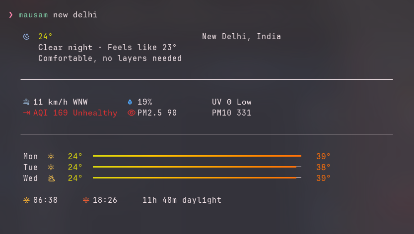
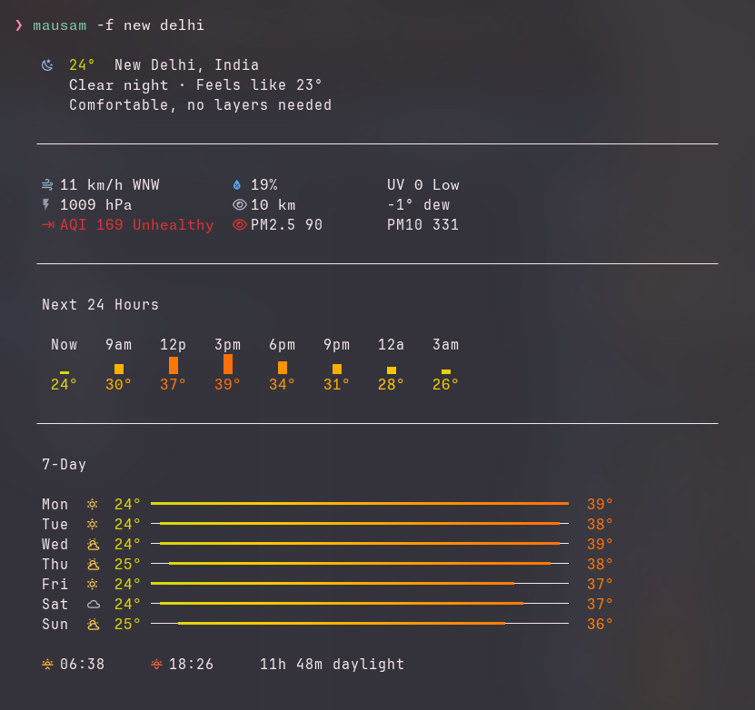

# mausam

Beautiful weather in your terminal.





## Features

- True color gradients and Nerd Font weather icons
- Context-aware icon colors (day/night/rain/snow/thunder/fog)
- Current conditions with feels-like, clothing hint, UV index
- Moon phase display with moonrise/moonset times
- Sunrise/sunset with daylight duration
- Wind speed with compass direction, visibility, dew point
- 3-day and 7-day forecast with temperature range bars
- 24-hour detailed forecast with sunrise-aware day/night icons
- Hourly sparkline charts with rain probability
- Air quality index (AQI) with PM2.5/PM10 breakdown
- Weather alerts display
- Multi-word cities (`mausam new york`) and city,country (`mausam delhi, india`)
- Multi-city comparison (`mausam london / tokyo / paris`)
- Auto-detect location from IP
- JSON output for scripting
- Response caching (15 min TTL)
- Imperial and metric units
- Responsive layout adapts to terminal width
- Shell completions (bash, zsh, fish, powershell)
- `NO_COLOR` standard compliance
- Interactive first-run setup
- Cross-platform (Linux, macOS, Windows)

## Install

### From crates.io

```sh
cargo install mausam
```

### Homebrew

```sh
brew tap codeptor/tap
brew install mausam
```

### AUR (Arch Linux)

```sh
yay -S mausam
```

### Quick Install (Linux/macOS)

```sh
curl -fsSL https://raw.githubusercontent.com/codeptor/mausam/master/install.sh | sh
```

### GitHub Releases

Pre-built binaries for Linux, macOS, and Windows are available on the [Releases](https://github.com/codeptor/mausam/releases) page.

### From source

```sh
git clone https://github.com/codeptor/mausam.git
cd mausam
cargo install --path .
```

## Setup

On first run, mausam will prompt you for a free [WeatherAPI](https://weatherapi.com/signup) key. Or configure it manually:

```sh
mausam --set-key YOUR_API_KEY
```

You can also set the key via environment variable:

```sh
export MAUSAM_API_KEY=YOUR_API_KEY
```

## Usage

```
mausam                         # Current weather (auto-detect city)
mausam london                  # Weather for London
mausam new york                # Multi-word city names work naturally
mausam delhi, india            # Disambiguate with country
mausam london / tokyo / paris  # Compare multiple cities
mausam -f                      # Full dashboard with hourly + 7-day
mausam -f new delhi            # Full view for a specific city
mausam -H                      # 24-hour detailed forecast
mausam -a                      # Air quality details
mausam -j                      # JSON output
mausam -r                      # Skip cache, force refresh
```

### Options

```
  [CITY]...              City name(s) — use / to separate multiple cities
  -f, --full             Full dashboard with hourly and 7-day forecast
  -H, --hourly           Show hourly forecast
  -a, --aqi              Show air quality details
  -j, --json             Output as JSON
  -r, --refresh          Force refresh, skip cache
      --no-color         Disable colored output
      --set-key <KEY>    Save API key to config
      --set-city <CITY>  Save default city to config
      --units <UNITS>    Set preferred units (metric/imperial)
      --completions <SHELL>  Generate shell completions (bash, zsh, fish, powershell)
      --config           Show current config
```

### Shell Completions

```sh
# Bash
mausam --completions bash > ~/.local/share/bash-completion/completions/mausam

# Zsh
mausam --completions zsh > ~/.local/share/zsh/site-functions/_mausam

# Fish
mausam --completions fish > ~/.config/fish/completions/mausam.fish
```

## Configuration

Config is stored at `~/.config/mausam/config.toml` (XDG-compliant):

```toml
api_key = "your_key_here"
default_city = "New Delhi"
units = "metric"        # or "imperial"
cache_ttl = 900         # seconds (default: 15 min)
```

View your current config:

```sh
mausam --config
```

## Requirements

- A terminal with true color support (most modern terminals)
- A [Nerd Font](https://www.nerdfonts.com/) for weather icons
- Free API key from [WeatherAPI.com](https://weatherapi.com/signup)

## License

MIT
